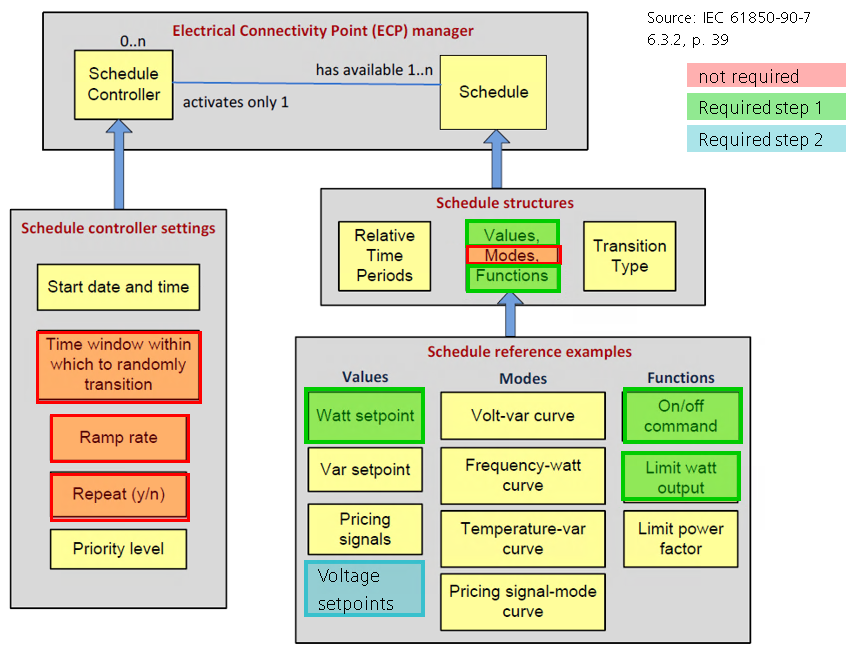

# REQUIREMENTS

Basic schedule funtionality shall be supported, as depicted below:

# Configuration

[C01]: Basic configuration of DER default shall be stored inside a SCL File:

[C01-a]: reserve schedule

[C01-b]: number of available schedules (maximum 10 schedules, less can be configured)

[C01-c]: number of devices to be controlled (limited to 1 for evaluation, extension shall be foreseen)

[C02]: Parameters of schedules other than the reserve schedule are to be stored in a key-value manner

[C03]: Parameters of schedules other than the reserve schedule are persisted to a sperate file (e.g. as JSON)

[C04]: Changes in schedules are persisted into the file as soon as the schedule is validated

[C05]: A interface to CoMPAS is not required.

[C05-a]: A simple interface to notify about changes in SCL file is to be defined.

[C05-b]: A simple interface to notify about changes in key-value

# Logical Nodes
[LN01]: Map Logical Nodes and Common Data Classes to configuration values, allow reading and writing according to 61850-10

[LN02]: Add X logical Nodes FSCHxx with subclasses according to 61850-10

[LN03]: Add 1 logical Node FSCC to control output of DER

# Scheduling
[S01]: A set of 10 schedules per logical device must be supported

[S02]: Support time based schdules

[S03]: Triggers other than time based may be supported

[S04]: Periodical schedules may be supported

[S05]: Support of absolute schedules of power setpoints

[S06]: Support of limiting watt output

[S07]: Other schedules, such as voltage (Volt-var curve), phase (Frequency-watt curve), or (more complex) percentage of total power may be supported (see 61850-7, figure 13, page 37)

[S08]: Validation of Schedules according to 61850-10

[S09]: Schedules for maximum generation values and absolute power values are modeled in the same way (using the same DTO)

# Schedule execution
[E01]: Execution of schedules must regard schedule priority according to 61850-10

[E02]: Resolution time base: >= 1 second
